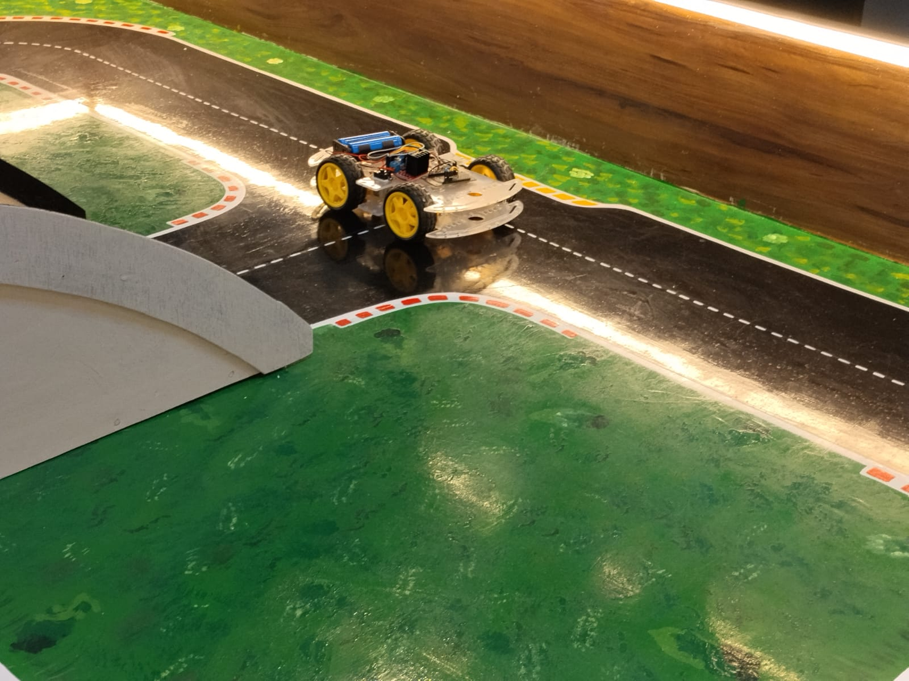

# ESP8266 Blynk RC Car 🚗

A Wi-Fi controlled RC car built using **NodeMCU ESP8266**, **L298N motor driver**, and **4 DC motors**. The car can be controlled remotely through the **Blynk IoT mobile application**.

## 🚀 Features

- Wi-Fi controlled RC car
- Control through Blynk mobile application
- Forward movement
- Backward movement
- Left and right movement
- Stop control
- 4-wheel drive using four DC motors
- NodeMCU ESP8266 as the main controller
- L298N motor driver for motor control
## 🛠️ Components Used

| Component | Quantity | Purpose |
|---|---:|---|
| NodeMCU ESP8266 | 1 | Main controller and Wi-Fi communication |
| L298N Motor Driver | 1 | Controls motor direction and movement |
| DC Gear Motors | 4 | Drives the four wheels |
| RC Car Chassis | 1 | Supports the complete car assembly |
| Battery | 1 | Provides power to the system |
| Jumper Wires | As required | Electrical connections |
| Blynk IoT | 1 | Mobile control interface |
## 🔌 Working

The NodeMCU ESP8266 receives commands from the Blynk mobile application through Wi-Fi.

The ESP8266 processes these commands and sends control signals to the L298N motor driver. The L298N then controls the direction and movement of the four DC motors.

### Basic Working Flow

Blynk App → Wi-Fi → NodeMCU ESP8266 → L298N Motor Driver → DC Motors → RC Car

## 💻 Software

- Arduino IDE
- Blynk IoT
- ESP8266 Board Package

## 📂 Project Structure

```text
blynk-rc-car
rc-car
arduinocode.ino

